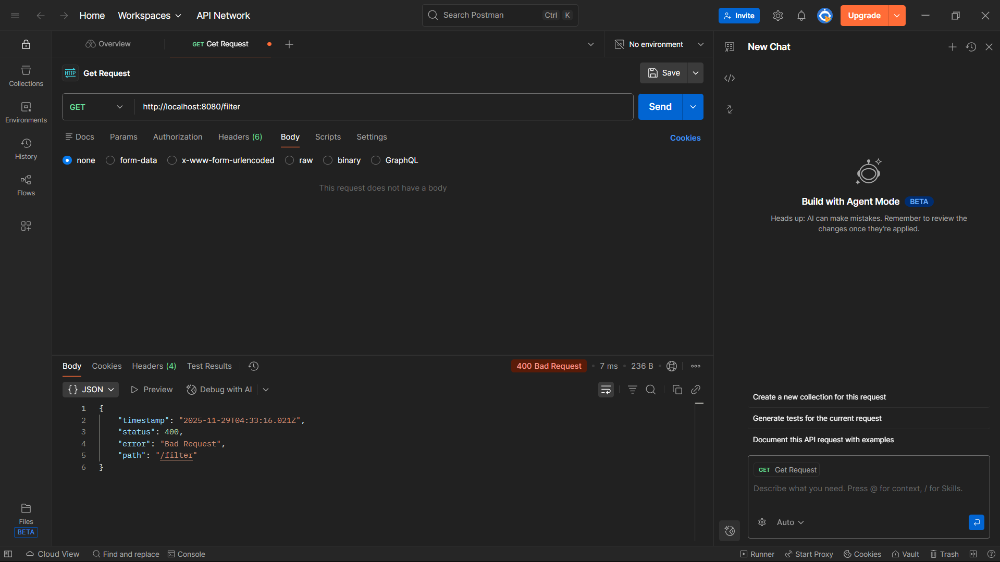
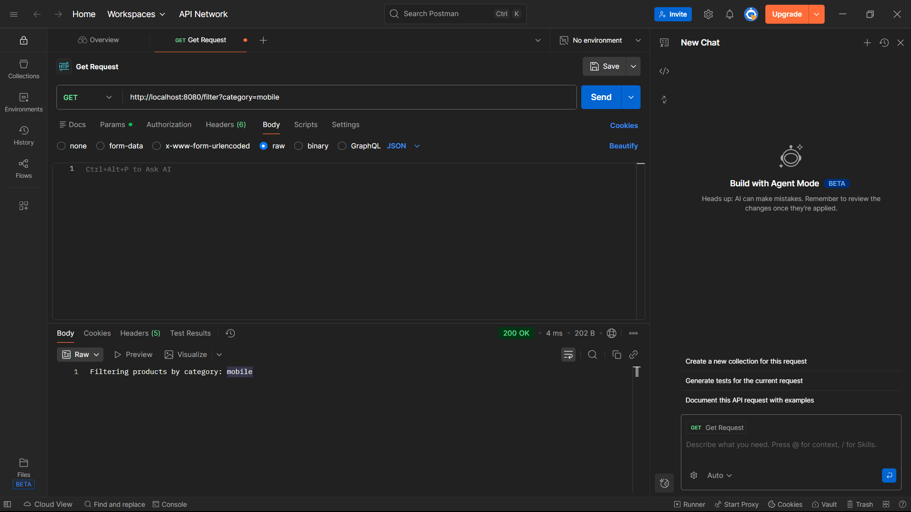
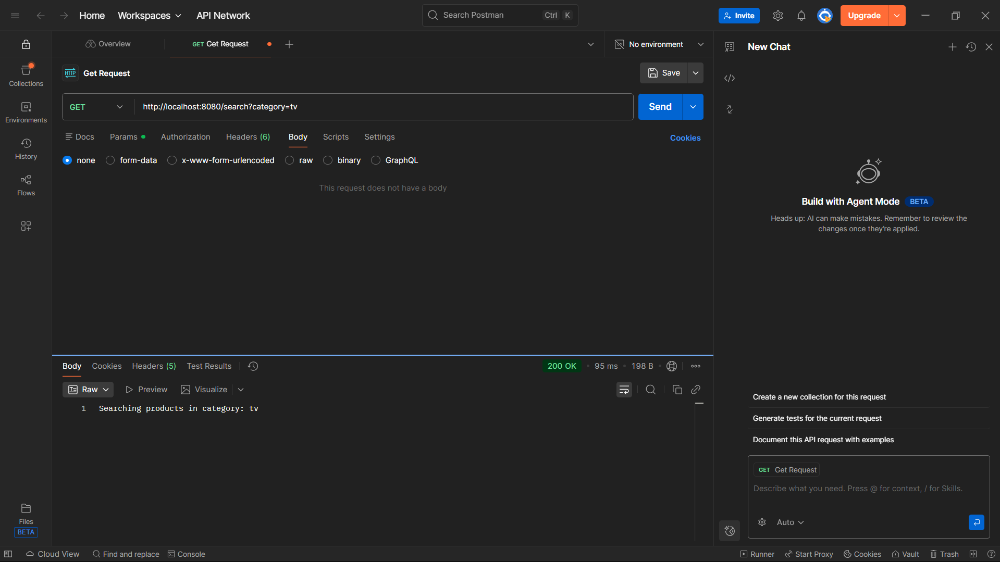
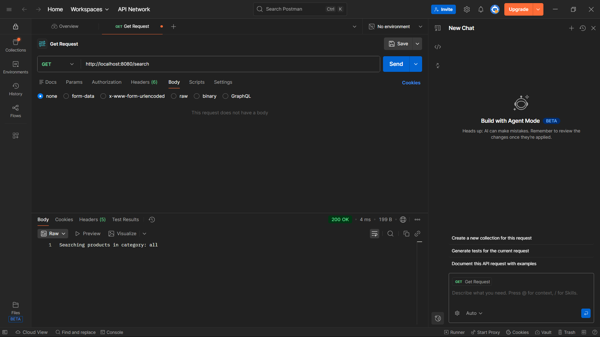
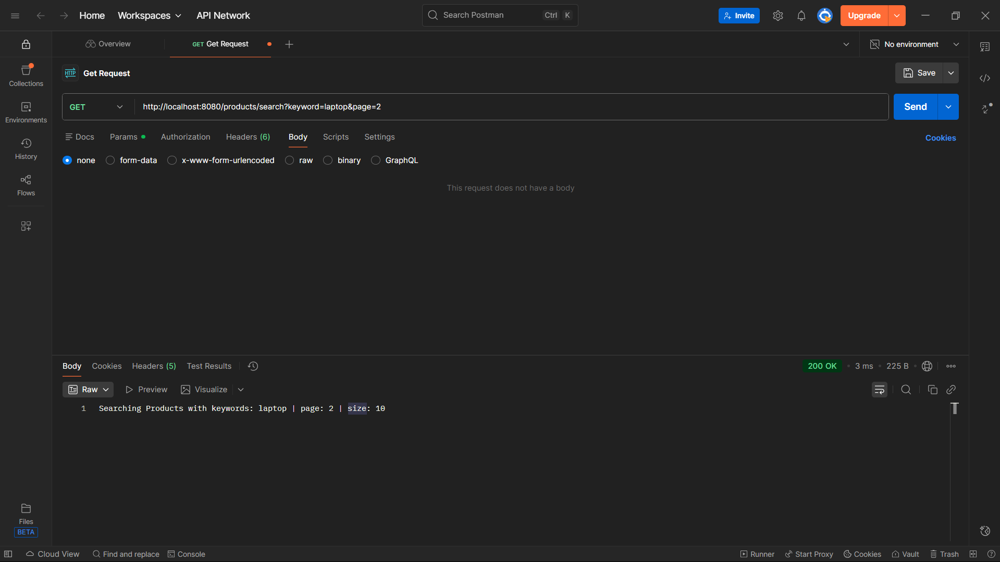
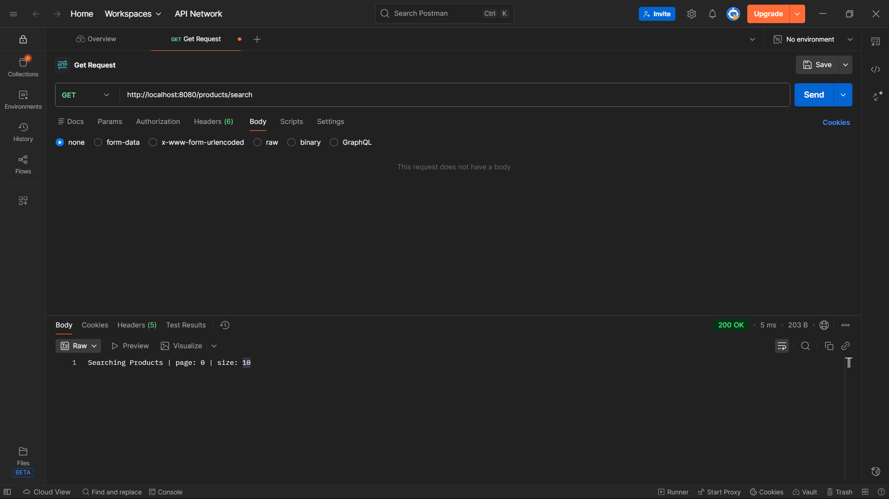

# 📍 Spring Boot - @RequestParam Demo

This project demonstrates how to use `@RequestParam` in Spring Boot for filtering, searching, and handling optional and required parameters in REST APIs.

---

## 🚀 Features

- Usage of **required request parameters**
- Usage of **default values**
- Handling **missing parameters**
- Filtering and searching products

---

## 🛠 Technology Stack

| Component  | Used              |
|------------|-------------------|
| Language   | Java              |
| Framework  | Spring Boot       |
| Build Tool | Maven             |
| Testing    | Postman / Browser |

---

## 📌 API Endpoints Tested

| Method | Endpoint                   | Description                                   |
|--------|----------------------------|-----------------------------------------------|
| GET    | `/filter?category=value`   | Filters products by category (required param) |
| GET    | `/products`                | Shows all products if no category is provided |
| GET    | `/products?category=value` | Shows filtered products                       |
| GET    | `/search?category=value`   | Searches category                             |
| GET    | `/search`                  | Uses default query param value `"all"`        |

---

## 🖼 Output Screenshots

### ❌ Missing Required Parameter

    
---

### ✔ Filter Products by Category

---

### ✔ Products with Explicit Category

---

### ✔ Products Without Parameter (Shows All)

---

### ✔ Search Products with Category

---

### ✔ Search Using Default Param Value (`all`)

---

### 7️⃣ Search With Multiple Query Parameters (`keyword + page + size`)
> Example: `/products/search?keyword=tv&page=1&size=5`

---

### 8️⃣ Search With Only Pagination Parameters (`page + size`)
> Example: `/products/search?page=0&size=10`

---

### 9️⃣ Search With Only Keyword
> Example: `/products/search?keyword=phone`

---

### 🔟 Search With Keyword + Pagination
> Example: `/products/search?keyword=laptop&page=2`

--

## 👨‍💻 Author

**Polaki Jaya Krishna**  
Final-year B.Tech | Java & Spring Boot Developer

---

### ⭐ If you find this useful, consider starring the repository!
